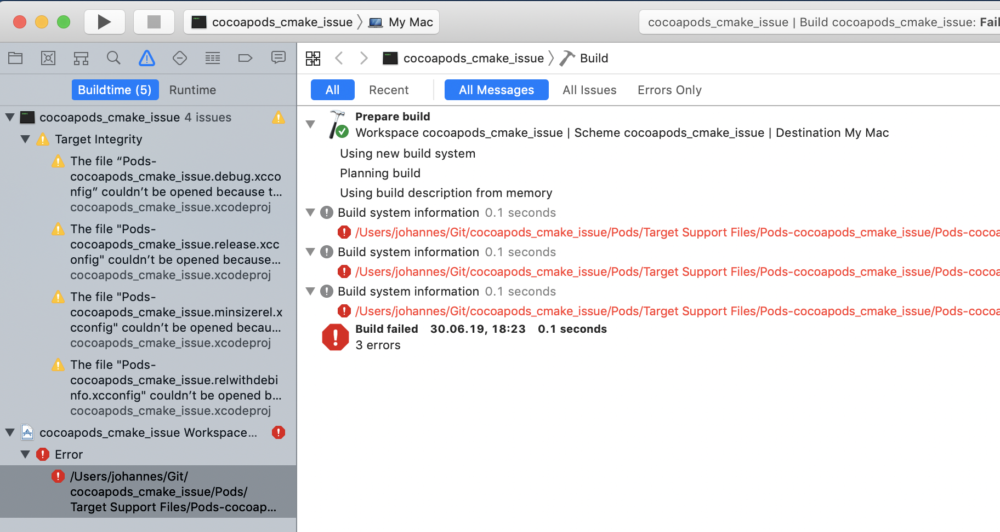

# cocoapods_cmake_issue :loudspeaker: 
example-project to reproduce an [issue](https://github.com/CocoaPods/Xcodeproj/pull/632) with cocoapods not working with a cmake-generated Xcode project.

## Requirements

- cmake >= 3.7
- cocoapods >= 1.7

## How to reproduce

1. configure cmake project with `cmake -H. -Bbuild -GXcode`
2. install pod dependencies with `cd build && pod install`
3. open the Xcode-workspace located in `build`
4. click `run` in Xcode
5. now Xcode reports an error, because it is "unable to open file" (See the screenshot below). 
   The reason ist that it searches for the file in the wrong directory.
   

   
**Disclaimer:** I have not been able to get this example up and running, 
it is possible that there is more wrong with it than just the issue with cocoapods.

**Please open an issue if you got any questions!**
